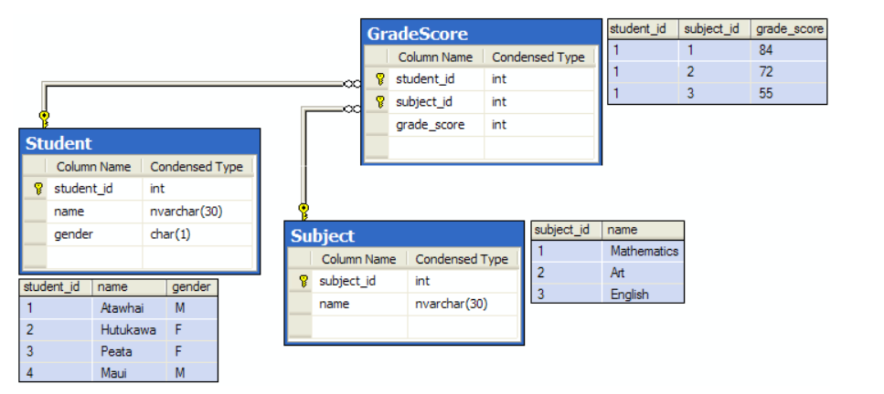
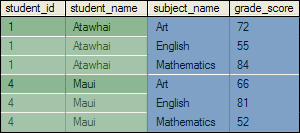

# Apply

Een veelgebruikte techniek binnen SQL is het combineren van datasets met JOINs. JOINs werken set-gebaseerd: twee reeds bestaande datasets worden samengevoegd op basis van een relatie. In sommige situaties is dit echter onvoldoende. Soms wil je namelijk per rij uit een tabel een afhankelijke berekening uitvoeren, waarbij de rechterkant van de query niet zelfstandig kan worden geëvalueerd zonder de linker rij.

Voor dit type probleem bestaat in SQL Server de ```APPLY```-operator.

## Wat doet APPLY?

De ```APPLY```-operator voert per rij van de linker inputset een afhankelijke subquery uit en combineert het resultaat met die rij in de uiteindelijke output. Met andere woorden: voor elke rij aan de linkerkant wordt een aparte dataset gegenereerd aan de rechterkant, gebaseerd op waarden uit die rij.

Dit maakt ```APPLY``` fundamenteel anders dan een ```JOIN```. Waar een ```JOIN``` twee bestaande datasets combineert, genereert APPLY per rij een nieuwe dataset.

De ```APPLY```-operator dankt zijn naam aan het oorspronkelijke gebruik: het “toepassen” van rijen uit een tabel op een table-valued function (TVF). Hoewel ```APPLY``` ook zonder expliciete functie gebruikt kan worden, helpt dit perspectief om het mechanisme goed te begrijpen.

## APPLY en database-ondersteuning

De ```APPLY```-operator is geïntroduceerd door Microsoft in SQL Server (2005). Andere databasesystemen zoals PostgreSQL, MariaDB, MySQL en Oracle ondersteunen vergelijkbare functionaliteit via de ```LATERAL``` keyword. De exacte syntax en uitvoering verschillen per systeem. In dit document richten we ons uitsluitend op SQL Server.

## Table-Valued Functions (TVF)

Een table-valued function is een herbruikbare functie die een tabel als resultaat teruggeeft en parameters kan accepteren. SQL Server kent twee varianten:

- **Inline Table-Valued Functions (iTVF)**: Bestaan uit één ```SELECT```-statement. SQL Server kan deze logisch in de query opnemen en volledig optimaliseren als onderdeel van het geheel.  
- **Multi-statement Table-Valued Functions (mTVF)**: Bestaan uit meerdere statements en gebruiken een expliciete return table.

Voor ```APPLY``` is vooral de inline TVF relevant, omdat deze zich gedraagt als een parametriseerbare subquery.

## Student voorbeeld

Om te laten zien hoe de ```APPLY``` operator kan worden toegepast gebruiken we een simpel voorbeeld. Stel je een simpele database voor van een school met de volgende tabellen:

- GradeScore  
- Student  
- Subject



We willen per student de vakken ophalen die diegene heeft gevolgd, inclusief het bijbehorende cijfer. Hiervoor definiëren we een inline Table Valued Function:

```sql
CREATE function dbo.GetSubjectAndScores (@StudentID as INT) 
RETURNS TABLE 
AS RETURN 
SELECT 	
subject_name = J.name, 
GS.grade_score 
FROM dbo.GradeScore GS 
JOIN dbo.subject J ON J.subject_id = GS.subject_id 
WHERE GS.student_id = @studentID;
```

Waarbij de aanroep ```dbo.GetSubjectAndScores(1)``` een tabel oplevert met de vakken en cijfers van student 1\.

Als we deze cijfers voor alle studenten willen gebruiken kunnen we de ```APPLY``` operator gebruiken:

```sql
SELECT 
S.student_id,
S.name as student_name,
iTVF.subject_name,
iTVF.grade_score
FROM dbo.student S
CROSS APPLY dbo.GetSubjectAndScores(S.student_id) iTVF
ORDER BY
S.student_id ASC,
iTVF.subject_name ASC;
```
Wat resulteert in de volgende output:



Voor iedere rij uit Student wordt de functie aangeroepen met de bijbehorende student\_id. Als de functie meerdere rijen teruggeeft, wordt de studentrij gedupliceerd in het resultaat. Dit verklaart waarom één student meerdere keren kan voorkomen in de output.

## Outer Apply vs Cross Apply

```CROSS APPLY``` werkt vergelijkbaar met een ```INNER JOIN```: Alleen rijen waarvoor de subquery of functie een resultaat oplevert, worden getoond.  
```OUTER APPLY``` werkt vergelijkbaar met een ```LEFT JOIN```: Ook rijen waarvoor geen resultaat wordt gevonden, blijven zichtbaar; de kolommen van de ```APPLY```-kant krijgen dan ```NULL```-waarden.

In het voorbeeld betekent dit dat studenten zonder geregistreerde cijfers:

- niet worden getoond bij ```CROSS APPLY``` 
- wel worden getoond bij ```OUTER APPLY```

Het is ook mogelijk om te werken zonder een create function te werken. Zo kun je de iTVF schrijven als een subquery:

```sql
SELECT 
S.student_id,
S.name as student_name,
iTVF.subject_name,
iTVF.grade_score
FROM dbo.student S
CROSS APPLY (
        SELECT J.name as subject_name,
             GS.grade_score
        FROM	 dbo.GradeScore GS
            JOIN 	 dbo.Subject J ON GS.subject_id = J.subject_id
            WHERE  GS.student_id = S.student_id
            ) iTVF
ORDER BY
S.student_id ASC,
iTVF.subject_name ASC;
```

Waarbij iedere rij vanuit student gebruikt wordt om de corresponderende vakken en cijfers op te halen.

## Apply vs Join

In veel gevallen kan een query met ```APPLY``` ook worden herschreven als een ```JOIN```. Het eerdere voorbeeld kan bijvoorbeeld ook als volgt worden geschreven:

```sql
SELECT
    S.Student_id,
    S.name as student_name,
    J.subject_name as subject_name,
    GS.grade_score grade_score
FROM dbo.student S
JOIN dbo.GradeScore GS 	ON S.student_id = GS.student_id
JOIN dbo.Subject J 	ON GS.subject_id = J.subject_id
ORDER BY S.student_id ASC,
J.subject_name ASC;
```

De SQL engine zal in het geval waarin een ```APPLY``` functioneel equivalent is aan een ```JOIN``` ook slim genoeg zijn om op dezelfde manier de query uit te voeren. Het is dus niet zo dat een ```APPLY``` operator altijd een nested loop gebruikt om over alle records te lopen en de TVF uit te voeren. Wel is het goed om aan te leren dat bij een functioneel equivalente exercitie, een ```JOIN``` de voorkeur heeft over een ```APPLY```. Deze wordt over het algemeen als eleganter en beter leesbaar gezien. 

## Wanneer APPLY

Er bestaan situaties waarin ```APPLY``` duidelijk beter aansluit bij het probleem dan een ```JOIN```. Een veelvoorkomend voorbeeld is het ophalen van een **top-N per groep**, waarbij de selectie afhankelijk is van sortering binnen die groep.

**Probleemstelling**  
Geef per student de twee hoogste cijfers, gesorteerd per student.

**Oplossing met APPLY**
```sql
SELECT
    S.student_id,
    S.name,
    T.subject_name,
    T.grade_score
FROM dbo.Student S
CROSS APPLY (
    SELECT TOP (2)
           J.name AS subject_name,
           GS.grade_score
    FROM dbo.GradeScore GS
    JOIN dbo.Subject J ON J.subject_id = GS.subject_id
    WHERE GS.student_id = S.student_id
    ORDER BY GS.grade_score DESC,
             GS.subject_id ASC
) T;
```

Deze query beschrijft expliciet wat er per student moet gebeuren: bepaal zijn cijfers, sorteer deze aflopend en neem de eerste twee. De logica is rij-afhankelijk en wordt direct per student toegepast.

Dezelfde vraag kan ook met een ```JOIN``` en een window function worden opgelost:

```sql
SELECT *
FROM (
    SELECT
        S.student_id,
        S.name,
        J.name AS subject_name,
        GS.grade_score,
        ROW_NUMBER() OVER (
            PARTITION BY S.student_id
            ORDER BY GS.grade_score DESC,
                     GS.subject_id ASC
        ) AS rn
    FROM dbo.Student S
    JOIN dbo.GradeScore GS ON S.student_id = GS.student_id
    JOIN dbo.Subject J ON J.subject_id = GS.subject_id
) AS RankedScores
WHERE rn <= 2;
```
Hoewel deze query correct is, is de intentie minder direct zichtbaar. Bovendien dwingt deze aanpak SQL Server om alle GradeScore-rijen te verwerken, per student te sorteren en te nummeren, voordat de filter ( rn \<= 2\) kan worden toegepast.

## Conclusie

De ```APPLY```-operator is geen vervanging voor ```JOIN```, maar een aanvulling. ```APPLY``` is vooral geschikt wanneer:

- de rechterkant van de query afhankelijk is van de linker rij;  
- per rij een aparte, gesorteerde of begrensde dataset moet worden opgebouwd;  
- de logica conceptueel rij-gericht is.

```JOIN``` blijft de voorkeur houden voor zuiver setgebaseerde combinaties. ```APPLY``` biedt een krachtig alternatief wanneer die benadering tekortschiet.

## Sources:   
[Understanding and Using APPLY (Part 1\) – SQLServerCentral](https://www.sqlservercentral.com/articles/understanding-and-using-apply-part-1)

[Understanding and Using APPLY (Part 2\) – SQLServerCentral](https://www.sqlservercentral.com/articles/understanding-and-using-apply-part-2)

[When Should We Use CROSS APPLY Over INNER JOIN? \- GeeksforGeeks](https://www.geeksforgeeks.org/sql-server/when-should-we-use-cross-apply-over-inner-join/)

[SQL Server CROSS APPLY and OUTER APPLY Helpful Examples](https://www.mssqltips.com/sqlservertip/1958/sql-server-cross-apply-and-outer-apply/)

[Understanding SQL Server CROSS APPLY and OUTER APPLY Queries \- Part 1](https://www.navicat.com/en/company/aboutus/blog/1783-understanding-sql-server-cross-apply-and-outer-apply-queries-part)