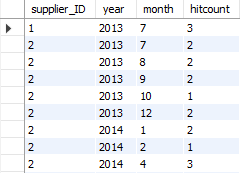
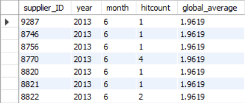
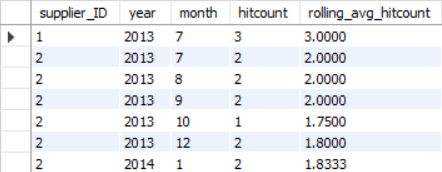

# Partition By

```PARTITION BY``` wordt gebruikt in combinatie met window functies om berekeningen uit te voeren over een logisch gedefinieerde groep rijen, zonder dat deze rijen worden samengevoegd tot één resultaat. Elke rij blijft afzonderlijk zichtbaar, terwijl de berekening wordt uitgevoerd over een subset van rijen die bij elkaar horen.

In tegenstelling tot ```GROUP BY``` beïnvloedt ```PARTITION BY``` dus niet het aantal rijen in het resultaat, maar uitsluitend het bereik waarover de window function wordt geëvalueerd.

## Window functions en de OVER-clause

```PARTITION BY``` wordt altijd gebruikt binnen de ```OVER```-clause van een window function. De algemene structuur is:

```sql
WINDOW_FUNCTION() OVER (
    PARTITION BY grouping_columns
    ORDER BY ordering_column
)
```

- ```PARTITION BY``` bepaalt welke rijen samen tot één logische groep behoren.  
- ```ORDER BY``` bepaalt de volgorde van rijen binnen die groep.

## Wanneer is ORDER BY nodig? 

Bij rangschikkings- en volgordefuncties zoals ```ROW_NUMBER```, RANK en ```DENSE_RANK``` is een ```ORDER BY``` essentieel. Zonder expliciete ordening is de volgorde van rijen binnen een partitie niet gedefinieerd, waardoor de uitkomst niet deterministisch is.

Bij aggregatiefuncties zoals ```AVG``` of ```SUM``` over een vaste groep rijen is de interne volgorde niet relevant en is een ```ORDER BY``` dus niet nodig.

## Voorbeeld

In de onderstaande voorbeelden gebruiken we een tabel met maandelijkse hitcounts per bedrijf. Elke rij representeert het aantal hits voor één bedrijf in een specifieke maand en een specifiek jaar.  


Door gebruik te maken van de ```PARTITION BY``` operator kunnen we in een tabel de data van ieder bedrijf laten zien, met daarbij het gemiddelde hitcount, over alle bedrijven, binnen de corresponderende maand.

```sql
SELECT *, AVG(hitcount) OVER (
                        PARTITION BY year, month
                        ) as month_avg_hitcount
FROM mhl_hitcount
```



## Rolling windows

Door ```ORDER BY``` toe te voegen binnen de ```OVER```-clause kan het venster dynamisch worden gemaakt. De berekening wordt dan uitgevoerd over alle rijen tot en met de huidige rij, volgens de opgegeven volgorde.

```sql
SELECT *, 
AVG(hitcount) OVER (
    PARTITION BY supplier_id 
    ORDER BY year, month
    ) as rolling_avg_hitcount
FROM mhl_hitcount
```


In dit voorbeeld:

- wordt per leverancier (supplier\_id) een aparte partitie gevormd;  
- worden de rijen binnen die partitie chronologisch geordend;  
- wordt per rij het gemiddelde berekend over alle voorgaande maanden inclusief de huidige maand.

Het venster groeit dus mee met de tijd.

## Rows Between … Preceding

Het is ook mogelijk om expliciet te vermelden hoeveel voorgaande waarden je wilt toevoegen in het venster met de toevoeging van een ```ROWS BETWEEN … PRECEDING``` statement. Hieronder zie je een statement die altijd de voorgaande 3 (of minder als er geen 3 bestaan) meeneemt in het evalueren van de window functie.

```sql
AVG(hitcount) OVER (  
    PARTITION BY supplier\_id  
    ORDER BY year, month  
    ROWS BETWEEN 3 PRECEDING AND CURRENT ROW  
)
```

| Window functie | Geen Order BY | Met ORDER BY |
| :---- | :---- | :---- |
| `SUM()` `AVG()` `COUNT()` `MAX()` `MIN()` | Aggregaat over de hele partitie volgorde van aggregreren heeft geen invloed op waarde | Aggregaat over alle voorgaande rijen en de huidige rij binnen de partitie, bepaald door de ORDER BY volgorde. |
| `RANK()` `DENSE_RANK()` `ROW_NUMBER()` `PERCENT_RANK()` | Niet afgedwongen hoe de volgorde is bepaalt waarde is niet deterministisch. | Kent een positie of rang toe aan elke rij binnen de partitie op basis van de opgegeven ordening |

*Overzicht van de combinaties van window functies en ORDER BY binnen een PARTITION BY*

## Voorbeeld

**Probleemstelling**  
Voor de schooldatabase willen we per student het volgende:

- zijn naam  
- de vakken die diegene gevolgd heeft  
- het behaalde cijfer per vak  
- het gemiddelde cijfer voor dat vak over alle studenten.

**Oplossing**

```sql
SELECT 	
S.name as student_name,
J.name as subject_name,
GS.grade_score as grade_score, 
AVG(GS.grade_score) OVER 
    (
    Partition BY J.subject_id
    ) 
FROM dbo.student S 
JOIN dbo.GradeScore GS on GS.student_id = S.student_id 
JOIN dbo.subject J ON J.subject_id = GS.subject_id
```

Zo blijven alle individuele cijfers zichtbaar en wordt er per rij het gemiddelde cijfer berekend.

## Conclusie

Partition by maakt het mogelijk om:

- context toe te voegen aan individuele rijen  
- aggregaties te berekenen zonder rijen samen te voegen  
- analyses te doen waarin detail en overzicht tegelijk nodig zijn

## Sources:  
[SQL PARTITION BY in PostgreSQL: A Guide to Window Functions and Data Segmentation.](https://www.dbvis.com/thetable/sql-partition-by-in-postgresql-a-guide-to-window-functions-and-data-segmentation/#:~:text=The%20PARTITION%20BY%20clause%20in%20SQL%20is%20used%20to%20divide,calculations%20within%20each%20subset%20independently).

[Window Functions in SQL - GeeksforGeeks](https://www.geeksforgeeks.org/sql/window-functions-in-sql/)