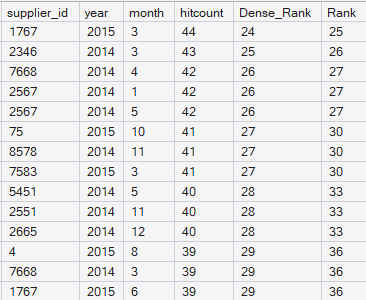
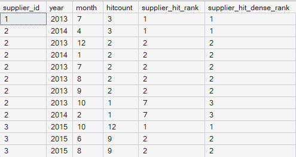

# RANK en DENSE\_RANK

```RANK``` en ```DENSE_RANK``` zijn window functies die rijen een positie toekennen binnen een geordende groep. Ze worden gebruikt wanneer je niet alleen wilt sorteren, maar ook expliciet wilt vastleggen hoe rijen zich tot elkaar verhouden binnen die sortering.

Beide functies werken altijd in combinatie met de ```OVER```-clause en vereisen een expliciete ```ORDER BY```.

## RANK

```RANK``` kent rijen een rang toe op basis van de sortering. Wanneer meerdere rijen dezelfde waarde hebben in de sorteerkolom, krijgen zij dezelfde rang. De eerstvolgende rij krijgt een rang die rekening houdt met het aantal voorgaande rijen, waardoor gaten in de rangschikking ontstaan.

```sql
SELECT supplier_id, year, month
RANK() OVER 
      (
    ORDER BY hitcount DESC
    ) AS Rank
FROM dbo.mhl_hitcount
```

## DENSE\_RANK

```DENSE_RANK``` werkt grotendeels hetzelfde als ```RANK```, maar zonder gaten in de rangschikking. Na gelijke waarden wordt de eerstvolgende rang gewoon opgehoogd met één.

Onderstaand voorbeeld toont het verschil tussen ```RANK``` en ```DENSE_RANK``` toegepast op dezelfde dataset:  



## Rank en Partition BY

Net als andere window functions kunnen ```RANK``` en ```DENSE_RANK``` worden gecombineerd met ```PARTITION BY``` om rijen te rangschikken binnen logische groepen.

```sql
SELECT
    supplier_id,
    year,
    month,
    hitcount,
    RANK() OVER (
        PARTITION BY supplier_id
        ORDER BY hitcount DESC
    ) AS supplier_hit_rank,
    DENSE_RANK() OVER (
        PARTITION BY supplier_id
        ORDER BY hitcount DESC
    ) AS supplier_hit_dense_rank
FROM dbo.mhl_hitcount
ORDER BY
    supplier_id,
    supplier_hit_rank;
```



In dit voorbeeld:

- wordt per leverancier een aparte rangschikking gemaakt;  
- wordt gekeken in welke maanden een leverancier relatief hoog of laag scoorde;  
- blijven alle rijen zichtbaar.

## Wanneer gebruik je welke?

De keuze tussen ```RANK``` en ```DENSE_RANK``` hang volledig af van wat je wilt interpreteren als rang. 

- Gebruik ```RANK``` wanneer je geïnteresseerd bent in de positie van de entiteit binnen de sortering. “Deze supplier staat 7e op basis van hitcount.”  
- Gebruik ```DENSE_RANK``` wanneer je geïnteresseerd bent in de positie van de eigenschapswaarde binnen alle entiteiten. “Dit is de 3e hoogste hitcount die voorkomt.”

## Conclusie

```RANK``` en ```DENSE_RANK``` maken expliciet wat sorteren impliciet laat: de relatieve positie van rijen.

- ```RANK``` drukt positie van entiteiten uit.  
- ```DENSE_RANK``` drukt positie van waarden uit.

## Sources:

[Rank and Dense Rank in SQL Server - GeeksforGeeks](https://www.geeksforgeeks.org/sql-server/rank-and-dense-rank-in-sql-server/)